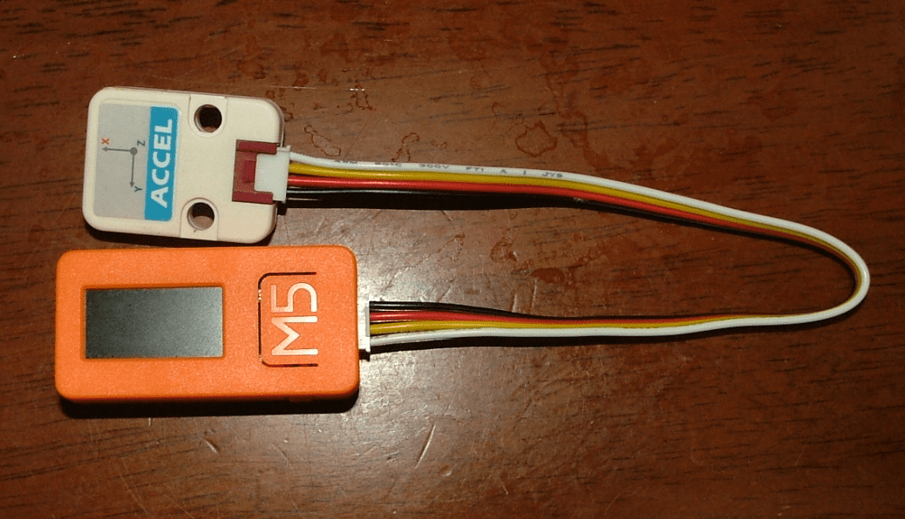
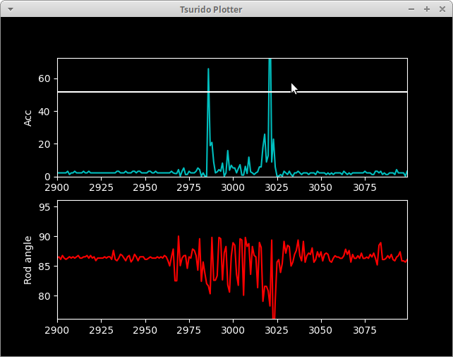
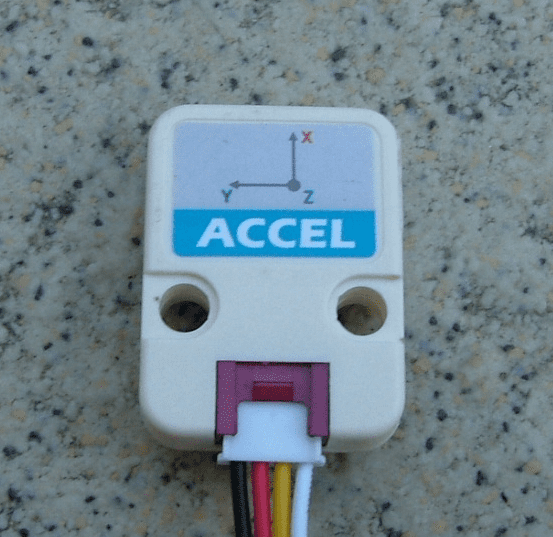

# Tsurido - M5StickCで投げ釣りの当たり判定をする

[](https://github.com/hotstaff/tsurido/)

# 機能

竿先の加速度を測定して魚のアタリを検知します。加速度の統計的外れ値を検出してアタリを判定します。

# DEMO

## ハードウェア構成

M5Stick・M5Atomに内臓のIMUユニットMPU6886/SH200QもしくはGrove接続加速度センサーモジュールADXL345をつなげたものを使用します。

- 構成例（ADXL345とM5StickC）



## クライアント



加速度と竿先の角度をモニタリングします。黄色い線は警報のしきい値を表しています。

# 必須条件

## センサー側

* M5StickCもしくはM5Atom(Lite, Matrix)

* ADXL345(grove接続)



内蔵のIMUユニットに対応したため、ADXL345は必須ではなくなりました。
対応表については下記を参照してください。


### ハードウェア構成別対応表

現在のところスケッチで対応している構成は以下のとおりです。すべての構成でbluetooth経由で接続及びパソコンを使って当たり判定・プロットができます。

| 構成 | スケッチ名 | プロット | スタンドアローンアタリ判定 | 省電力モード | バッテリー動作 | 備考
| ---- | ---- | :----: | :----: | :----: | :----: | ---- |
| M5StickC単体 | [tsurido-m5stickc.ino](https://github.com/hotstaff/tsurido/tree/master/sketch/tsurido-m5stickc) | ◯ | ◯ | ◯ | ◯ | USE_INTERNAL_IMU = trueへ設定が必要 |
| M5StickCとADXL345 | [tsurido-m5stickc.ino](https://github.com/hotstaff/tsurido/tree/master/sketch/tsurido-m5stickc) | ◯ | ◯ | ◯ | ◯ | USE_INTERNAL_IMU = falseへ設定が必要 |
| M5AtomMatrix単体 | [tsurido-m5atom.ino](https://github.com/hotstaff/tsurido/tree/master/sketch/tsurido-m5atom) | × | ◯ | × | × | USE_INTERNAL_IMU = trueへ設定が必要 |
| M5AtomMatrixとADXL345 | [tsurido-m5atom.ino](https://github.com/hotstaff/tsurido/tree/master/sketch/tsurido-m5atom) | × | ◯ | × | × | USE_INTERNAL_IMU = falseへ設定が必要 |
| M5AtomLiteとADXL345 | [tsurido-m5atom.ino](https://github.com/hotstaff/tsurido/tree/master/sketch/tsurido-m5atom) | × | ◯ | × | × | USE_INTERNAL_IMU = falseへ設定が必要 |

## クライアント側

* Python3が動く環境
* Bluetoothアダプターが使えること

# インストール

## リポジトリのクローン

```bash
git clone https://github.com/hotstaff/tsurido
cd tsurido
```

## ライブラリのインストール

以下のライブラリをインストールしてください。

* 必須ライブラリ
  - Adafruit_BluefruitLE
  - numpy
  - matplotlib
  - pyaudio  
  - simpleaudio
  - pydub

例えばubuntu20.04だと以下のような順番でインストール可能です。

Adafruit_BluefruitLEは公式リポジトリ版は最新のBluezに対応できてないためbluezのバージョンが以下のレポジトリのものをインストールします。

パッチ適用済み Adafruit Python BluefruitLE ライブラリのインストール

```bash
git clone　https://github.com/donatieng/Adafruit_Python_BluefruitLE
cd Adafruit_Python_BluefruitLE
sudo python3 setup.py install
```

pyaudioをインストールする前にportaudioをインストールする必要があります。

ubuntu系の場合
```bash
sudo apt-get install portaudio19-dev
```

残りのライブラリのインストール

```bash
sudo pip install numpy matplotlib pyaudio simpleaudio pydub
```

これで使う準備ができました。

# 使い方

## スケッチの転送

まず、ArduinoIDEから次のADXL345のライブラリが使用できるようにしてください。

- Accelerometer ADXL345(ADXL345.h)
     - 作者
         - Seeed Studio
     - [Website(githubのリポジトリ)](https://github.com/Seeed-Studio/Accelerometer_ADXL345)

その後、ArduinoIDEからsketchフォルダの以下にあるスケッチを転送してください。正常に書き込められれば、電源を入れるとすぐに測定を開始します。

## クライアントの起動

Bluetoothアダプターを接続したあとclient.pyを実行してください。

```bash
python3 client.py
```

もしくは

```bash
python3 client.py DEVICE_NAME
```

で起動します。このDEVICE_NAMEはスケッチで指定したものを指定してください。デフォルトはTsuridoになっています。別々のデバイスネームを指定すれば同時に複数のプロッターを起動できます。

## クライアントの起動オプション

### プロットのオプション

プロットのオプションは次のとおりです。
```bash
python3 client.py DEVICE_NAME -i 2 -w 200 -s 5 10 -na
```

- `-i`: プロット間隔の設定（default 4)　意味は`N`回に１回描画する。数を大きくするとプロット負荷を抑えられます。プロットの内容は変わりません。
- `-w`: プロットの幅の設定（default 200）プロットの幅を設定します。平均値及び標準偏差の計算元データも同じ幅になります。
- `-s`: 当たり判定の感度設定　(default 5 10) 警告のしきい値及びグラフレンジを設定します。この場合は`5σ`で警告音、`10σ`がグラフの縦軸上限になります。
- `-na`: 竿先の角度の非表示 (defalut `true`)

### 接続のリセット

前の接続が残っており接続できない場合は

```bash
python3 client.py DEVICE_NAME --reset
```

--resetオプションを指定することで再接続できることがあります。
このオプションを指定すると、接続中のすべてのデバイスが切断されます。

### 接続を切断しない

```bash
python3 client.py DEVICE_NAME --keepalive
``` 

あまり使用する機会はないと思いますが、このオプションを指定すると終了するときに接続を切断せずに終了します。
このオプションを使うことで同じデバイスに同じアダプターから複数のプロットが立ち上げられます。


# 注意

本プログラムは、あなたに対して何も保証しません。あなたが、本プログラムを利用（閲覧、投稿、外部での再利用など全てを含む）する場合は、自己責任で行う必要があります。

- 利用の結果生じた損害及び釣果について、一切責任を負いません。
- あなたの適用される法令に照らして、本プログラムの利用が合法であることを保証しません。
- コンテンツとして提供する全ての文章、画像、音声情報について、内容の合法性・正確性・安全性等、あらゆる点において保証しません。
- リンクをしている外部サイトについては、何ら保証しません。
- 事前の予告無く、コンテンツの提供を中止する可能性があります。

# 作者

* Hideto Manjo

# License

"tsurido" は [LGPL](./LICENCE)ライセンスの元で公開されています。
